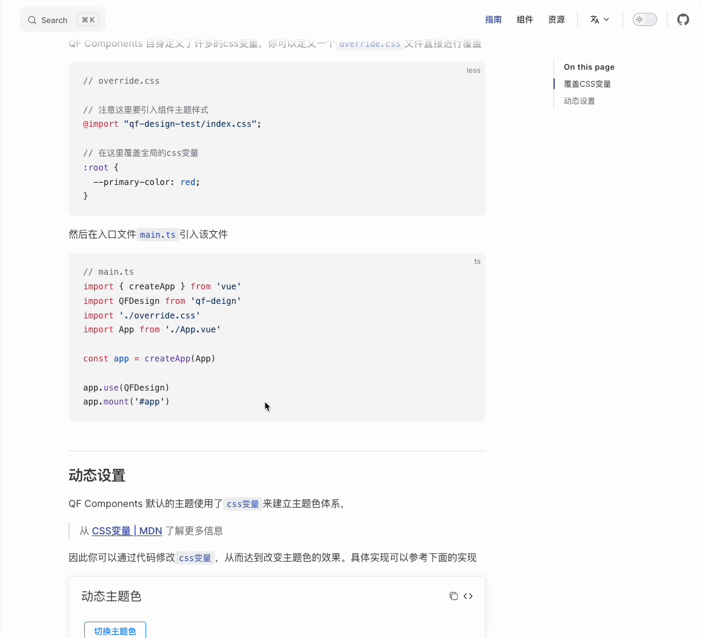

<p align="center">
  
</p>


> 一个基于vue3.0的组件库




- 💪 Vue 3 组合式API
- 🔥 基于typescript编写
ı
## 连接

- [首页](https://qf-design-test.github.io/qf-design-test/)
- [所有组件](https://qf-design-test.github.io/qf-design-test/component/button/)

- [定制主题]()
- [国际化](暂无)

## Install

```shell
npm install qf-design -S
```

## Quick Start

```javascript
import Vue from 'vue';
import qfDesign from 'qf-design';
import App from './App.vue';

const app = createApp(App);
app.use(qfDesign);

app.mount('#app');
```

For more information, please refer to [Quick Start](http://element.eleme.io/#/en-US/component/quickstart) in our documentation.

## 浏览器支持

Modern browsers.

| [](http://godban.github.io/browsers-support-badges/)<br>Edge | [](http://godban.github.io/browsers-support-badges/)<br>Firefox | [](http://godban.github.io/browsers-support-badges/)<br>Chrome | [](http://godban.github.io/browsers-support-badges/)<br>Safari | 
| --- | --- | --- | --- |
| Edge | last 2 versions | last 2 versions | last 2 versions   |                                                                                                                                                                                         | last 2 versions |


## 开发者

如果你只想使用qf-design，那么可以跳转这部分

对于那些有兴趣建设的同学，请参阅我们的PR规范
([中文](https://github.com/ElemeFE/element/blob/master/.github/CONTRIBUTING.zh-CN.md)）

## Changelog

每个版本的详细更改记录在[release notes](https://github.com/qf-design-test/qf-design-test/releases).

## FAQ

遇到问题可以直接联系我们QQ 1205669217

## 交流群

<!-- 使用微信扫描二维码

 -->

## LICENSE

[MIT](LICENSE)
